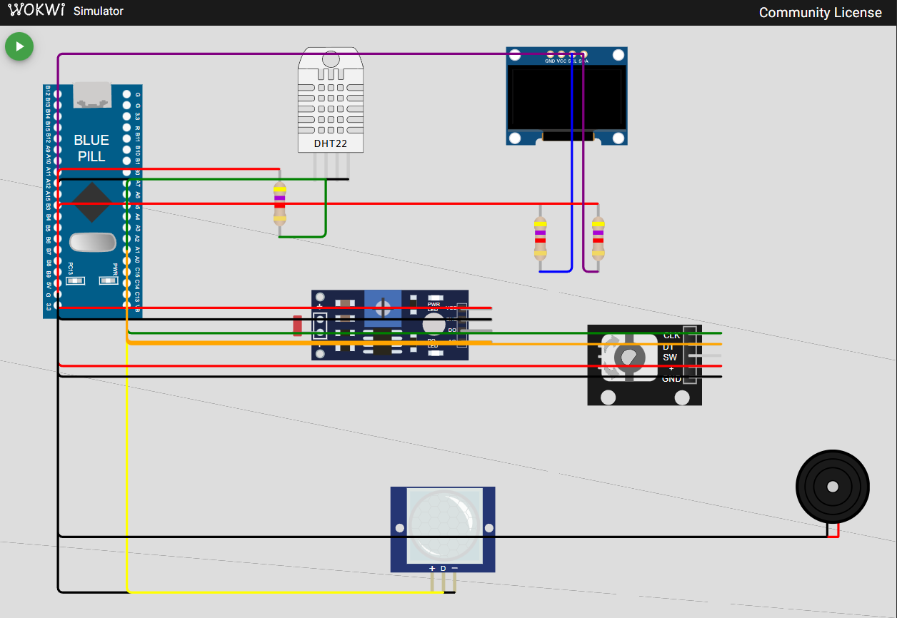
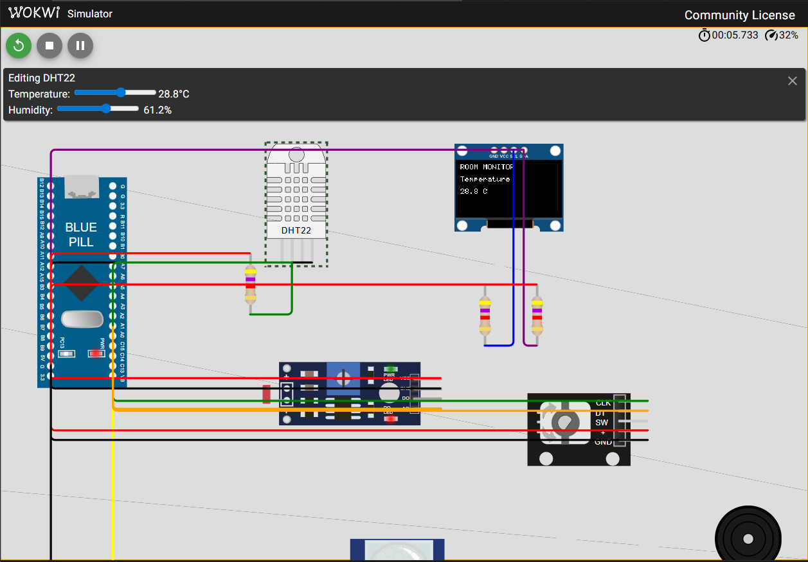

# STM32 FreeRTOS Room Multisensor

## Project Overview

A STM32F103C8 room monitor built for BCA182 Laboratory Activity 1 using
STM32Cube HAL and native FreeRTOS. Temperature, humidity, relative light,
and motion drive selectable OLED pages and a temperature alarm.
[Development history](docs/part-xviii-git-history.md) records the engineering milestones.

## Features

- DHT22 and analog light acquisition every two seconds.
- Temperature, Humidity, Light, and Motion pages selected by rotary encoder.
- PWM buzzer alarm below 18 C or above 30 C; endpoints are normal.
- PIR wake-up and 15-second inactivity handling.
- Queues, event flags, mutex protection, validity checks, and sample drop tracking.

## Learning Objectives

Design blocking tasks, justify priorities by urgency, enforce peripheral
ownership, communicate data through queues, protect shared resources, and
test deterministic decisions separately from hardware. Interpret analysis
findings and fault experiments using actual observations.

## System Architecture

~~~mermaid
flowchart LR
    DHT["DHT22"] --> Sensors["SensorTask"]
    LDR["Analog LDR"] --> Sensors
    PIR["PIR"] --> Motion["MotionTask"]
    Encoder["Encoder"] --> Input["InputTask"]
    Sensors --> Display["DisplayTask"]
    Sensors --> Alarm["AlarmTask"]
    Sensors --> Log["SensorLogTask"]
    Input --> Display
    Motion --> State["Activity state and events"]
    State --> Sensors
    State --> Display
    State --> Alarm
    Display --> OLED["OLED"]
    Alarm --> Buzzer["PWM buzzer"]
    Log --> Serial["USART1"]
~~~

*Figure 2. Owning tasks connect sensor inputs to display, alarm, and logging;
activity state gates acquisition and output behavior.*

## FreeRTOS Architecture

[scripts/freertos.py](scripts/freertos.py) compiles STM32CubeF1's bundled
FreeRTOS 10.3.1 kernel with heap_4 and a configured 14 KiB heap. Application
code uses native APIs, without Arduino or CMSIS-RTOS wrappers.

| Environment | CPU and tick | Scheduling |
|---|---|---|
| bluepill_wokwi | 8 MHz HSI; 100 Hz tick from polled TIM3 | Custom cooperative Thread-mode switching |
| bluepill_f103c8 | 72 MHz HSE/PLL; 1000 Hz SysTick | Standard preemptive GCC Cortex-M3 port |

Wokwi selects ready tasks at yield/block points; it does not demonstrate
interrupt preemption. HAL time retains millisecond resolution.
See [scheduling notes](docs/part-iii-scheduling.md).

## Hardware / Simulated Components

Blue Pill, DHT22 with 4.7k pull-up, analog photoresistor module, SSD1306
128x64 OLED at 0x3c with two 4.7k I2C pull-ups, KY-040 encoder, PIR, PWM buzzer,
and 115200-baud 8N1 serial monitor. Encoder button and LDR digital output are unused.

*Figure 1 caption: Blue Pill wiring for the sensors, encoder, OLED, and buzzer,
showing common ground and data/bus pull-ups. Wiring source: [diagram.json](diagram.json).*

*Figure 5 caption: Running monitor with the DHT22 temperature control and OLED
Temperature page both showing 28.8 C.*

## Pin Configuration

| Signal | Blue Pill pin | Interface / supply |
|---|---|---|
| DHT22 data | PA1 | GPIO; 4.7k pull-up to 3.3 V |
| LDR AO | PA0 | ADC1 channel 0; module at 3.3 V |
| Encoder CLK / DT | PA2 / PA3 | Pull-up inputs; encoder at 3.3 V |
| PIR OUT | PA4 | GPIO; PIR supplied at 5 V in Wokwi |
| OLED SCL / SDA | PB6 / PB7 | I2C1, 100 kHz; pull-ups and OLED at 3.3 V |
| Buzzer signal | PB8 | TIM4 channel 3; 2 kHz PWM |
| USART1 TX / RX | PA9 / PA10 | Serial monitor RX / TX respectively |

All modules share ground. TIM2 supplies the 1 MHz DHT pulse timebase;
TIM3 is reserved for Wokwi timekeeping. Physical electrical behavior remains unverified.

## Task Design

Normal mode priorities and stack sizes follow src/app.cpp. Higher numbers
mean greater scheduling urgency; stack sizes are 32-bit words.

| Task | Priority | Stack | Work / blocking |
|---|---:|---:|---|
| SensorTask | 3 | 384 | Two-second deadline; waits for DHT readiness and ACTIVE |
| MotionTask | 2 | 256 | PIR polling every 50 ms |
| InputTask | 2 | 256 | Encoder position polling every 10 ms |
| AlarmTask | 2 | 256 | Sample receive with 100-ms timeout; rejects samples older than 3 seconds |
| DisplayTask | 1 | 384 | Update checks every 20 ms; waits for ACTIVE when off |
| SensorLogTask | 1 | 384 | Blocks on sensor FIFO |
| Task A / Task B | 1 | 256 each | One-second diagnostic deadlines |

SensorTask outranks polling to protect synchronous DHT pulse acquisition
on hardware. Motion/input/alarm outrank presentation and logging. All normal
tasks block; these intervals are design targets, not measured worst-case
latency. See [priority rationale](docs/part-xii-priorities.md).

## Inter-Task Communication

~~~mermaid
flowchart TD
    Sensor["SensorTask"] --> FIFO["Sensor FIFO / 4 samples"]
    FIFO --> Log["SensorLogTask"]
    Sensor --> DQ["Display mailbox / latest sample"]
    DQ --> Display["DisplayTask"]
    Sensor --> AQ["Alarm mailbox / latest sample"]
    AQ --> Alarm["AlarmTask"]
    Input["InputTask"] --> MQ["Mode mailbox / latest page"]
    MQ --> Display
    Motion["MotionTask"] --> Events["ACTIVE / MOTION / ALARM events"]
    Alarm --> Events
    Events --> Sensor
    Events --> Display
    Events --> Observer["Task B"]
    Writers["Task diagnostics"] --> Mutex["Serial mutex"]
    Mutex --> UART["USART1"]
~~~

*Figure 3. Separate mailboxes prevent display and alarm from consuming each
other's data; a FIFO preserves logging order and a mutex protects UART ownership.*

SensorMessage is copied by value with validity, raw ADC, sequence/drop counts,
and activity epoch. A full logging FIFO increments the drop count without
blocking acquisition. Latest-value mailboxes overwrite stale queued updates.
MotionTask owns ACTIVE/MOTION; AlarmTask owns ALARM. Persistent ACTIVE wakes
both sensor and display waiters. A state mutex protects coherent snapshots;
serial and state locks are never held together.
See [queues](docs/part-v-data-communication.md), [events](docs/part-x-events.md),
and [mutex ownership](docs/part-xi-mutex.md).

## State Machine

~~~mermaid
stateDiagram-v2
    [*] --> ACTIVE
    ACTIVE --> ACTIVE: PIR high / refresh deadline
    ACTIVE --> INACTIVE: 15 seconds without motion
    INACTIVE --> ACTIVE: PIR motion detected
~~~

*Figure 4. Motion refreshes the activity deadline and wakes an inactive system.*

INACTIVE switches off the OLED, pauses acquisition, ignores navigation changes,
and silences the buzzer while PIR monitoring remains active. Diagnostic tasks
can continue. This is application inactivity, not hardware low-power sleep.
The 15 seconds starts after PIR clears; the configured two-second pulse can
make a single trigger lead to inactivity after about 17 simulated seconds.
Wake preserves the selected page and rejects old-epoch samples; Waiting may
briefly appear until a valid new sample arrives.
See [state behavior](docs/part-ix-motion-state.md).

## Repository Structure

~~~text
include/       Task interfaces, pure logic, configuration, message types
src/           Startup, tasks, RTOS objects, peripheral drivers
ports/wokwi/   Cooperative simulator port
scripts/       Build integration, native compiler setup, fault selector
test/          Unity suites and supplemental compile/context checks
docs/          Design, verification records, findings, history
diagram.json   Wokwi circuit
wokwi.toml     Simulator firmware paths
platformio.ini Build, unit-test, and analysis environments
~~~

main.cpp initializes HAL/clock; app.cpp creates objects/tasks and starts the
scheduler. See [module organization](docs/part-xiii-modules.md).

## Getting Started

Use Git, Python 3, PlatformIO Core, and VS Code with the Wokwi extension.
Clone and open the repository root:

~~~powershell
git clone https://github.com/uninhabitableelbow/bca182-freertos-multisensor.git
cd bca182-freertos-multisensor
python scripts/select_fault.py 0
~~~

PlatformIO installs configured dependencies. The native host-test setup
uses a managed MinGW compiler on Windows.

## Building the Project

~~~powershell
pio run -e bluepill_wokwi
~~~

Build again after firmware changes. The physical configuration is separate:

~~~powershell
pio run -e bluepill_f103c8
~~~

Neither command uploads firmware. The STM32 platform is pinned to
ststm32@20.0.0 with framework = stm32cube.

## Running the Wokwi Simulation

After building bluepill_wokwi, press F1 and choose Wokwi: Start Simulator.
[wokwi.toml](wokwi.toml) loads .pio/build/bluepill_wokwi/firmware.bin and
firmware.elf. Confirm startup, Task A/B, and subsequent sensor samples.

Trigger PIR to keep ACTIVE, select a page with the encoder, and change
component controls. Stop before selecting fault modes. Wokwi time is
simulated time; wall-clock progress depends on simulator speed.

## Unit Testing

~~~powershell
pio test -e native
~~~

All 34 tests passed: 11 alarm, 13 navigation/encoder, and 10 system-state cases.
Tests execute production pure logic with boundaries, invalid measurements,
encoder cycles/bounce, and timing wraparound. Plain pio test selects the
default firmware environment and does not run host suites.
See [coverage](docs/part-xiv-unit-tests.md).

## Static Code Analysis

~~~powershell
pio check --fail-on-defect high --fail-on-defect medium
pio check -e bluepill_f103c8 --fail-on-defect high --fail-on-defect medium
~~~

Both firmware configurations passed with 0 high, 0 medium, and 33 reviewed
low findings. The [findings table](docs/part-xv-static-analysis.md) explains
cross-module unused-function reports, vendor macro casts, and the HAL callback
signature. The OLED lookup suggestion was corrected; remaining findings are visible.

## Functional Verification

The user confirmed all ten [functional tests](docs/part-xvi-functional-verification.md):
measurement changes, both navigation directions, alarm/normal behavior,
PIR activity, inactivity, and wake-up. Results are user-reported; separate
measured values and captured evidence were not supplied for that run.

[Fault experiments](docs/part-xvii-fault-experiments.md) recorded continuous
Task A output without its delay, no visible issue with increased input priority,
and clean serial output without the mutex. Mode 0 was restored and user-confirmed.
These observations do not establish preemptive hardware behavior.

## Engineering Decisions

- Separate drivers and tasks define peripheral ownership.
- Latest-value mailboxes serve display/alarm; FIFO logging tracks drops.
- Validity and epoch checks prevent errors or pre-sleep samples driving alarms.
- DHT minimum-interval waiting avoids publishing an early read as a failed sample.
- Hardware PWM avoids software buzzer loops; OLED caching sends changed spans.
- Safe-point encoder polling avoids simulator interrupt storms; hardware uses EXTI.
- A cooperative Wokwi port and lower CPU clock retain responsive simulation;
  the physical build retains the standard preemptive port.

## Limitations

Physical electrical behavior, timing, and worst-case scheduling remain
unverified. Cooperative simulation can hide preemption-related contention.
Light is an inverted ADC percentage, not calibrated lux. DHT acquisition is
synchronous and interrupt-latency sensitive. The font supports application labels.
Pure unit tests do not cover peripherals/concurrency; static analysis does not
prove runtime correctness. Supplemental Unicorn tests model peripherals and
are not claimed as a freshly verified test of the current full application.

The running-system screenshot demonstrates temperature display agreement;
it does not provide evidence of every functional test or physical operation.

## Future Improvements

Measure physical latency and stack headroom, use timer capture for DHT pulses,
calibrate light against lux, expand error/display diagnostics, and automate
integration checks with real peripheral timing and recorded evidence.

## References and Acknowledgments

Requirements: BCA182 Laboratory Activity No. 1, Real-Time Multisensor Room
Monitoring System, Asst. Prof. Paul Rodolf P. Castor, September 2026.

- [Wokwi Blue Pill](https://docs.wokwi.com/parts/board-stm32-bluepill)
- [Wokwi project configuration](https://docs.wokwi.com/vscode/project-config)
- [PlatformIO unit testing](https://docs.platformio.org/en/latest/core/userguide/cmd_test.html)
- [PlatformIO Cppcheck](https://docs.platformio.org/en/stable/advanced/static-code-analysis/tools/cppcheck.html)
- [FreeRTOS kernel](https://github.com/FreeRTOS/FreeRTOS-Kernel)
- [STM32CubeF1](https://github.com/STMicroelectronics/STM32CubeF1)
- [Prior STM32/Wokwi compatibility investigation](https://github.com/monxx-ie/BCA182-freetos-multisensor#running-freertos-in-wokwi-simulator-compatibility)
